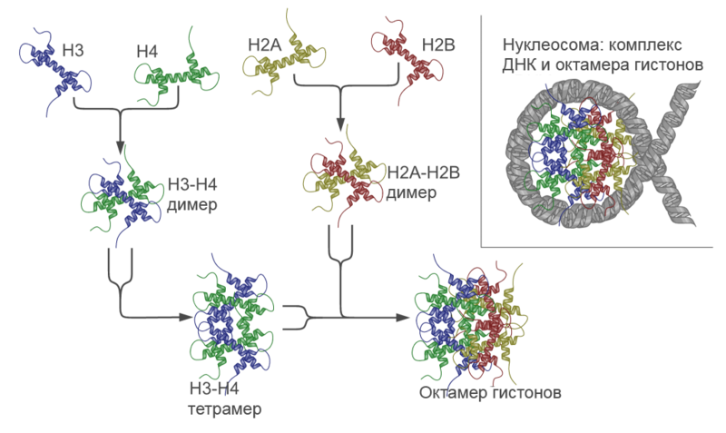

= Нуклеосома

Нуклеосома представляет собой сегмент двуцепочечной ДНК длиной 147 п.н, образующий 1,65 витка вокруг белкового октамера, который сформирован тетрамером гистонов (Н3-Н4)2 и двумя димерами гистонов Н2А-Н2В. Нуклеосома имеет дискообразную структуру высотой 5,5 нм и диаметром 11 нм. 

*Структура и «сборка» нуклеосомы.* Показано образование и строение гистонного октамера и структура комплекса ДНК-гистонный октамер — нуклеосомы.

Коровые гистоны – высоко консервативные эукариотические белки, в нуклеотидной последовательности которых присутствует много положительно заряженных аминокислотных остатков, благодаря чему они могут нейтрализовать отрицательный заряд ДНК. Каждый из коровых гистонов содержит консервативную центральную часть, называемую доменом гистоновой складки, состоящую из трех α-спиралей, связанных друг с другом короткими петлями – данная структура обуславливает гетеродимеризацию Н2А-Н2В и Н3-Н4. Помимо гистоновой складки каждый гистон содержит менее консервативный неструктурированный N-конец, функционирующий как мишень для различных ферментов модификации гистонов, а также, предположительно, обеспечивающий стабилизацию нуклеосом.

Образование стабильного тетрамера (Н3-Н4)2 через интерфейс Н3:Н3 инициирует сборку нуклеосом: тетрамер связывает центральную часть ДНК, затем димеры Н2А-Н2В последовательно связываются с тетрамером (Н3-Н4)2 через интерфейс Н4:Н2В. N-концевые гистоновые хвосты взаимодействуют не только с ДНК, обернутой вокруг гистонового кора, но и с линкерной ДНК, локализующейся между нуклеосомами и связанной линкерным гистоном Н1. Линкерный гистон не является родственным коровым гистонам и имеет отличную структуру центрального домена, названную «крылатой спиралью».

Гистон Н1 связывается с нуклеосомой в области диады и взаимодействует с линкерной ДНК, замыкая второй полный оборот ДНК вокруг гистонового октамера.

В течение многих лет считалось, что нуклеосомы необходимы лишь для упаковки ДНК, и структура хроматина «бусы на нитке» препятствует процессам репликации, транскрипции и репарации. Изначально предполагалось, что удаление нуклеосом восстановит интенсивность протекания перечисленных процессов до уровня, характерного для свободной ДНК, но было экспериментально подтверждено, что ядерные процессы с участием хроматина протекают значительно более активно, чем с участием ДНК. Это указывает на то, что нуклеосомы являются не просто структурными единицами хроматина, а функциональными участниками регуляции экспрессии генов.

Массивы нуклеосом очень динамичны, что критически необходимо для репликации, транскрипции и репарации, так как сайты связывания ДНК- зависимых белковых комплексов, осуществляющих эти процессы, часто экранированы гистоновым октамером. Существуют два общих механизма, обеспечивающих доступ к закрытым сайтам-мишеням на нуклеосомной ДНК: спонтанные конформационные флуктуации нуклеосом и репозиционирование нуклеосом за счет АТФ-зависимых факторов ремоделирования хроматина. Функционально значимые режимы динамики нуклеосом включают в себя:

&#8226; нуклеосомное «дыхание» («breathing») – процесс, при котором концы нуклеосомной ДНК временно диссоциируют от поверхности гистонов

&#8226; раскрытие («opening») – нуклеосомная ДНК интенсивнее диссоциирует от гистонового кора

&#8226; расхождение («gaping») – два витка нуклеосомной ДНК перемещаются друг относительно друга в направлении, перпендикулярном плоскости ДНК

&#8226; сжатие/ослабление ДНК («DNA tightening/loosening») – процесс, при котором уменьшается/увеличивается соответственно количество пар нуклеотидов, связанных с гистоновым ядром

&#8226; скольжение нуклеосом («sliding») – процесс, при котором контактирующая с гистоновым кором последовательность ДНК смещается